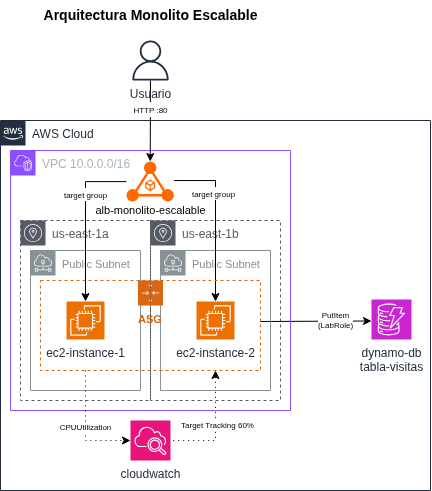

# 🏗️ Monolito Escalable en AWS

> Evaluación Módulo 6: Arquitectura Cloud (SOFOFA). Diseño e implementación de una arquitectura monolítica escalable en AWS Academy Learner Lab, migrando una aplicación desde un servidor on-premise hacia una infraestructura con alta disponibilidad, escalabilidad automática y monitoreo.

## 📌 Contexto de negocio

Una empresa de servicios digitales opera su aplicación en un único servidor on-premise, lo que provoca caídas en picos de tráfico y altos costos de mantenimiento. El objetivo de este proyecto es migrar dicha aplicación a AWS **manteniendo el enfoque monolítico** (sin descomponer en microservicios), pero resolviendo los problemas de disponibilidad y escalabilidad mediante servicios administrados de AWS.



## 🎯 Objetivo de la arquitectura

- **Escalabilidad automática** ante picos de demanda (Auto Scaling Group)
- **Alta disponibilidad** mediante balanceo de carga (Application Load Balancer)
- **Monitoreo básico** de la infraestructura (Amazon CloudWatch)
- *(Opcional)* Persistencia gestionada con DynamoDB

## 🗺️ Arquitectura de alto nivel

El diagrama completo está en [`diagrams/export/`](./diagrams/export/). Vista general:

```
Internet → ALB (multi-AZ) → Auto Scaling Group → EC2 (monolito)
                                                       ↓
                                                  CloudWatch (métricas + alarmas)
```

## 📂 Estructura del repositorio

| Carpeta | Contenido |
|---|---|
| [`docs/`](./docs) | Contexto, arquitectura general y guía de implementación paso a paso |
| [`adr/`](./adr) | Architecture Decision Records, el *porqué* detrás de cada decisión técnica |
| [`diagrams/`](./diagrams) | Diagrama de arquitectura (fuente `.drawio` y exportado) |
| [`evidence/`](./evidence) | Capturas de pantalla que evidencian cada lección implementada |

## ☁️ Servicios AWS utilizados

- Amazon EC2
- Elastic Load Balancing (ALB)
- EC2 Auto Scaling
- Amazon CloudWatch
- Amazon DynamoDB *(opcional)*
- Amazon VPC

## 📖 Decisiones de arquitectura (ADR)

| ADR | Decisión |
|---|---|
| [ADR-0001](./adr/ADR-0001-estrategia-migracion-monolito-ec2.md) | Estrategia de migración: monolito en EC2 |
| [ADR-0002](./adr/ADR-0002-seleccion-load-balancer.md) | Selección de Load Balancer |
| [ADR-0003](./adr/ADR-0003-estrategia-auto-scaling.md) | Estrategia de Auto Scaling |
| [ADR-0004](./adr/ADR-0004-monitoreo-y-alarmas.md) | Monitoreo y alarmas |
| [ADR-0005](./adr/ADR-0005-persistencia-dynamodb.md) | Persistencia con DynamoDB *(opcional)* |

## ✅ Estado del proyecto

- [x] Lección 1 — Despliegue base en EC2
- [x] Lección 2 — Balanceo de carga (ALB)
- [x] Lección 3 — Auto Scaling Group
- [x] Lección 4 — Monitoreo con CloudWatch
- [x] Lección 5 — Persistencia con DynamoDB (opcional)
- [x] Lección 6 — Diagrama de arquitectura

## 👤 Autor

Fidel Vera, Ingeniero Industrial